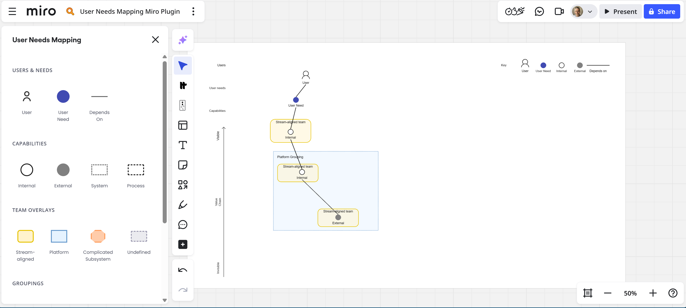

# User Needs Mapping plugin for Miro

[](https://app.netlify.com/projects/miro-user-needs-mapping/deploys)

This plugin provides ready-to-use shapes to build User Needs Maps in [Miro](https://miro.com).

Based on the User Needs Mapping technique by Richard Allen [@conjurer-rich](https://github.com/conjurer-rich).

> See [userneedsmapping.com](https://userneedsmapping.com) for more details about User Needs Mapping.
> Copyright © 2025-2026 [Conjurer Solutions Ltd](https://conjurersolutions.co.uk) - Licensed under [CC BY-SA 4.0](https://creativecommons.org/licenses/by-sa/4.0/) 



## What is User Needs Mapping?

User Needs Mapping is a visual technique for mapping user needs to organizational capabilities. It helps teams understand:

- Who the users are
- What needs those users have
- What internal and external capabilities exist to meet those needs
- How capabilities depend on each other
- Which teams own which capabilities

## How it works

### Available Shapes

### Users & Needs

- **User** - Person silhouette representing a user type
- **User Need** - Blue filled circle representing a user need
- **Depends On** - Connector line showing dependencies

### Capabilities

- **Internal** - White circle with border for internal capabilities
- **External** - Gray filled circle for external capabilities
- **System** - Dotted border rectangle for systems
- **Process** - Dashed border rectangle for processes

### Team Overlays

- **Stream-aligned** - Yellow rounded rectangle for stream-aligned teams
- **Platform** - Blue rectangle for platform teams
- **Complicated Subsystem** - Orange octagon for complicated subsystem teams
- **Undefined** - Gray rounded rectangle for undefined team types

### Groupings

- **Value Stream** - Yellow dotted rectangle for value stream groupings
- **Platform** - Blue dotted rectangle for platform groupings
- **Undefined** - Gray dotted rectangle for undefined groupings

### Using the Plugin

1. Open the User Needs Mapping plugin from your Miro board
2. Drag and drop shapes onto the canvas to build your map
3. Use "Create Frame" to generate a starter template with labels and legend
4. Edit shapes and labels as needed (they're standard Miro shapes)

## Run the app locally

### Prerequisites

- Node.js 16+
- npm

### Installation

```bash
npm install
npm start
```

Your local server will start at `http://localhost:3000`

### Configure in Miro

1. Follow [these steps](https://developers.miro.com/docs/build-your-first-hello-world-app#step-2-create-a-developer-team-in-miro) to create a Miro Developer Team
2. Create a new app in your Developer Team settings
3. Set the **App URL** to `http://localhost:3000`
4. Install the app on a board to test

## Build for production

```bash
npm run build
```

This generates static output in the `dist/` folder, which can be hosted on any static hosting service.

## Project Structure

```text
src/
├── index.ts          # App entry point - opens panel on icon click
├── app.tsx           # React panel UI with draggable shapes
├── utils/
│   ├── shapes.ts     # Shape factory functions
│   └── template.ts   # Starter template generator
└── assets/
    └── style.css     # Panel styling
```

## Contributing

Contributions are welcome! Please feel free to submit issues and pull requests.

## License

This work is licensed under [CC BY-SA 4.0](https://creativecommons.org/licenses/by-sa/4.0/).

Built using [`create-miro-app`](https://www.npmjs.com/package/create-miro-app) and [Vite](https://vitejs.dev/).